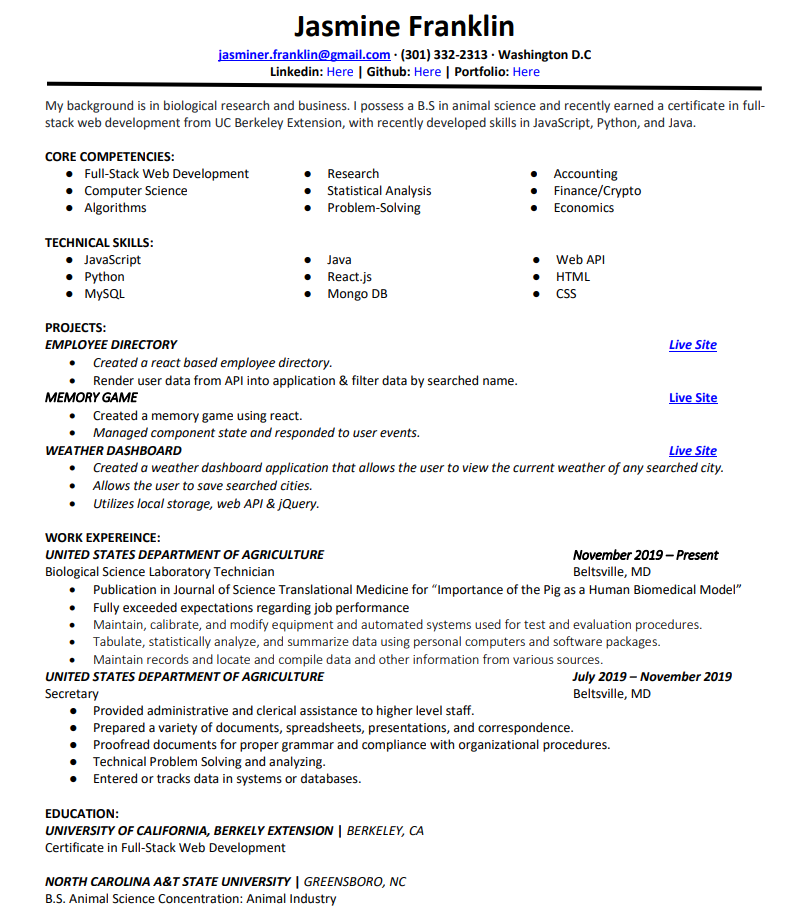

# portfolio-3.0
Create an updated repository
<br>
===========


<br>

## Pin 3 Projects

```
      <div class= 'row'>
        <div class= 'col-4'>
            <h2>Financial Umbrella</h2>
            <a href='https://slimbeek6.github.io/team7-score-dash/'>Deployed Link</a>
            <a href='https://github.com/slimbeek6/team7-score-dash'>GitHub Repo</a>
        </div>

        <div class= 'col-8'>
            <div class='card' style='width: 75%;'>
                
            </div>
        </div>       
    </div>

```
<br>

## Downloadable Resume PDF

```
     <h2>Click Resume To Download</h2>
    <h1><a href="New Resume.pdf"></a></h1>
```
<br>

## Mobile Responsive

```
.work-feature-block {
    padding: 10px 0;
    border-top: 1px solid #cacaca;
    border-bottom: 1px solid #cacaca;
  }
  
  .work-feature-block-image {
    display: block;
    margin: auto;
    padding: 10px 0;
  }g
```

<br>

## Built With

* [HTML](https://developer.mozilla.org/en-US/docs/Web/HTML)
* [CSS](https://developer.mozilla.org/en-US/docs/Web/CSS)
* [Javascript](https://developer.mozilla.org/en-US/docs/Web/JavaScript)
* [Bootstrap](https://getbootstrap.com/)

## Deployed Link

* [See Live Site](https://jas-f.github.igit o/portfolio-3.0/)

## License

This project is licensed under the MIT License 

See also the list of [contributors](https://github.com/your/project/contributors) who participated in this project.

## Prerequisites

Git hub,
Git lab,
Git bash,
Visual studio,
Google chrome,
Bootstrap,
JavaScript,
JQuery

## Authors

**Jasmine Franklin C: 301-332-2313 E: jasminer.franklin@gmail** 

- [Link to Portfolio Site](https://jas-f.github.io/portfolio-3.0/)
- [Link to Github](https://github.com/)
- [Link to LinkedIn](https://www.linkedin.com/in/jasmine-franklin-8b08ba121)

<p>&copy; UC Berkeley Extension Bootcamp.</p>
